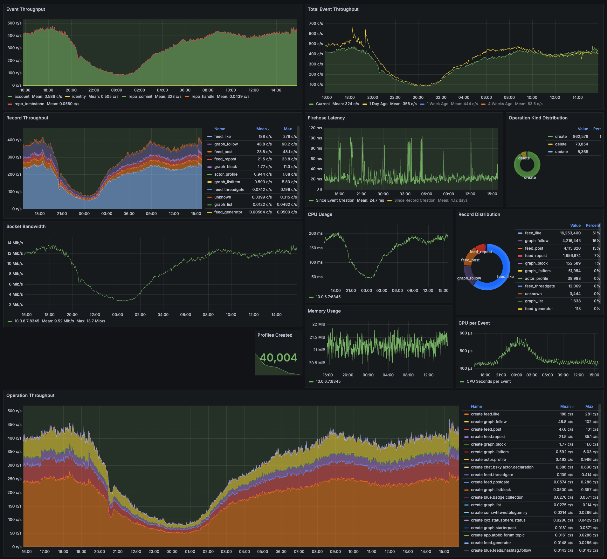

# Sonar
Sonar is an AT Proto Firehose Montioring tool

Sonar connects to an AT Proto Firehose (either from a PDS or a Relay) following the semantics of `com.atproto.sync.subscribeRepos`.

Sonar monitors the throughput of events, producing prometheus metrics on the frequency of different kinds of events.

Sonar additionally walks through repo operations and tracks the frequency of creation/update/deletion of different record collections.

Sonar's main use is to provide an operational dashboard of activity on the network, allowing us to view changes in event rate over time and understand what kinds of traffic flow through the firehose over time.

## Running Sonar

To run sonar in Docker locally, you can run: `make sonar-up` from the root of the `indigo` directory.

This will start a sonar instance that connects to the Bluesky-operated Relay firehose at `bsky.network` and will expose metrics at `http://localhost:8345`

Feel free to modify the `docker-compose.yml` in this directory to change any settings via environment variables i.e. to change the firehose host `SONAR_WS_URL` or the listen port `SONAR_PORT`.

## Dashboard

Sonar emits Prometheus metrics which you can scrape and then visualize with the Grafana dashboard (JSON template provided in this directory) shown below:

